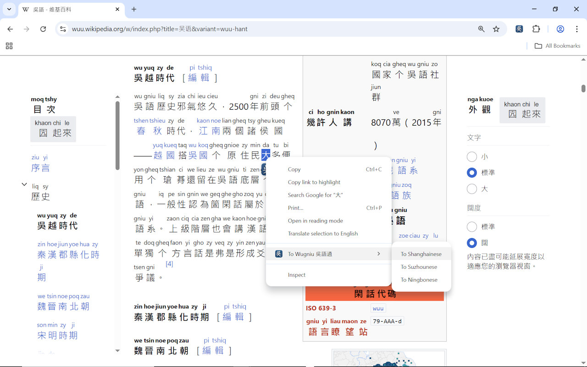
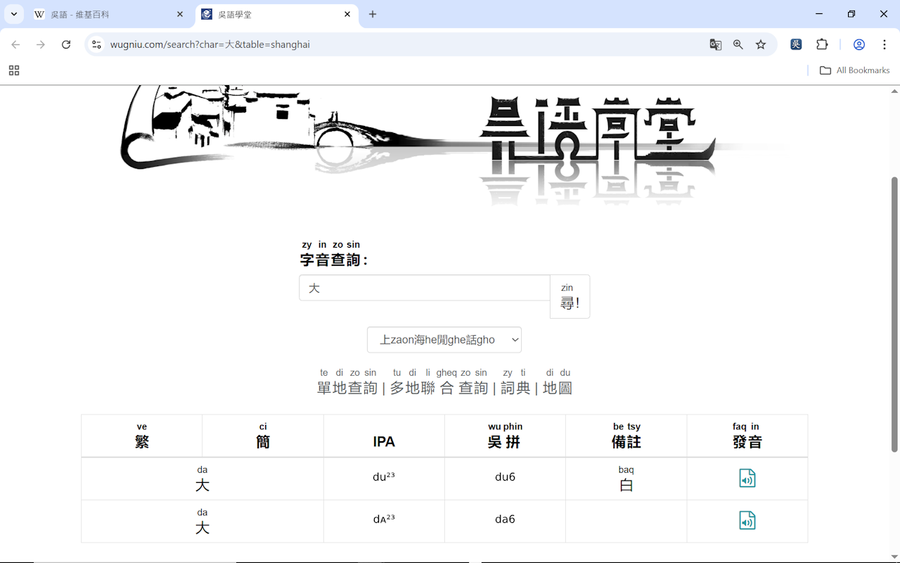
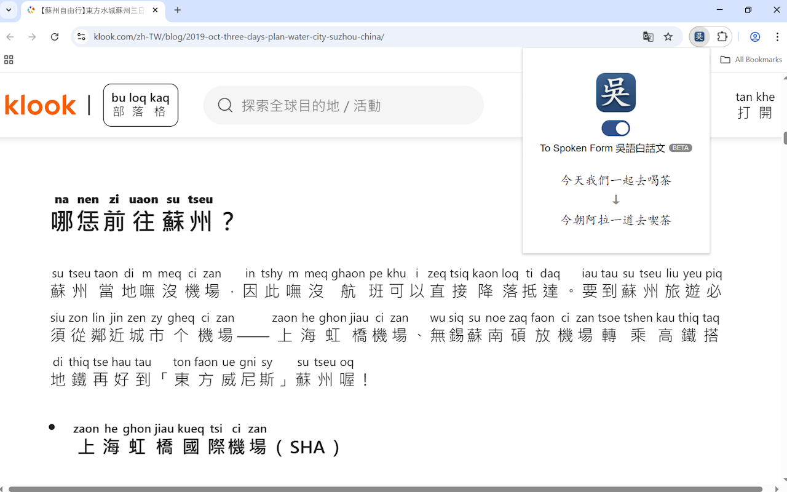

# To Wugniu <ruby>吳<rt>wu</rt></ruby> <ruby>語<rt>gniu</rt></ruby> <ruby>通<rt>thon</rt></ruby>
This Chrome extension displays Wu (Shanghainese) pronunciation above Chinese characters and can translate websites from Mandarin to Shanghainese.

## Download <ruby>下<rt>gho</rt></ruby> <ruby>載<rt>tse</rt></ruby>
- [Chrome Web Store](https://chromewebstore.google.com/detail/gkfjbikjgdjfkpjnbjofdadakgpohkom?utm_source=item-share-cb)

## Features <ruby>功<rt>kon</rt></ruby> <ruby>能<rt>nen</rt></ruby>

#### 吳
- 垃垃**每隻漢字**高頭顯示**吳語學堂拼音**，幫儂操練吳語（上海言話）閱讀。
- 看勿懂吳拼？選隻漢字，撳記彈出來个「吳」圖標就好上吳語學堂，聽該字个**讀音音頻**。
  - 假使儂右擊選好个漢字，還好通過菜單聽該字垃**蘇州言話**搭**寧波言話**裏向个讀音。
- 讀起來有眼喫力？撳記右上角拼圖裏向个「吳」圖標就好拿網頁從**書面語**（例：「你好」）翻譯成**吳語白話文**（例：「儂好」）。
#### EN
- Adding **Wugniu** above **every Chinese character**, making it easier to read and learn Wu (Shanghainese).
- Select any character, and click the “吳” icon to instantly access wugniu.com, which provides **audio pronunciations** and other learning resources.
  - Right-click the selected Chinese character to explore its audio pronunciation in **different Wu varieties**.
- Easily switch between **written form** and **spoken form** by clicking the extension icon in the top right corner..

## Notes <ruby>注<rt>tsy</rt></ruby> <ruby>意<rt>i</rt></ruby>
- 箇個擴展採用仔**中老派**上海言話注音，保留仔部分通用垃老上海个**尖團音**
- 注音是基於**漢字本字**个吳語發音，而勿是轉譯為吳語白話文。比方講「<ruby>你<rt>ni</rt></ruby>」會得注為 **ni**，而勿是白話裏向个「<ruby>儂<rt>nong</rt></ruby>」。
  - 書面語譬如「<ruby>你<rt>ni</rt></ruby> <ruby>在<rt>ze</rt></ruby> <ruby>這<rt>tseq</rt></ruby>」垃垃今朝主要是出現垃**滬劇**裏向，而平常則會得講「<ruby>儂<rt>nong</rt> </ruby><ruby>垃<rt>laq</rt></ruby><ruby>垃<rt>laq</rt></ruby> <ruby>箇<rt>geq</rt></ruby><ruby>墶<rt>taq</rt></ruby>」或者「<ruby>儂<rt>nong</rt></ruby> <ruby>垃<rt>laq</rt></ruby><ruby>塰<rt>he</rt></ruby> <ruby>此<rt>tshy</rt></ruby><ruby>地<rt>di</rt></ruby>」（ 類似於粵語書面語「<ruby>你<rt>nei5</rt></ruby> <ruby>在<rt>zoi6</rt></ruby> <ruby>這<rt>ze5</rt></ruby>」搭白話「<ruby>你<rt>nei5</rt></ruby> <ruby>喺<rt>hai2</rt></ruby> <ruby>呢<rt>ni1</rt></ruby><ruby>度<rt>dou6</rt></ruby>」之間个差異）。
- 箇個擴展目前還垃垃**公開測試階段**，部分翻譯搭注音（特別是垃文白異讀高頭）仍舊需要改良。假使儂尋着錯誤或者有建議，歡迎聯繫[此地](mailto:dev.tder@gmail.com)。

## Sources <ruby>來<rt>le</rt></ruby> <ruby>源<rt>gnioe</rt></ruby>
- [吳語學堂](https://www.wugniu.com/)
- [吳語學堂音系及拼音方案](https://github.com/NGLI/rime-wugniu_zaonhe/wiki/%E9%9F%B3%E7%B3%BB%E5%8F%8A%E6%8B%BC%E9%9F%B3%E6%96%B9%E6%A1%88)
- [吳語學堂上海吳語拼音輸入方案](https://github.com/NGLI/rime-wugniu_zaonhe.git)
